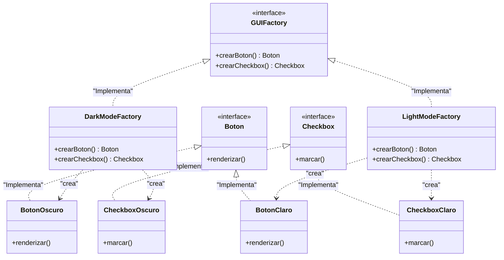

# Abstract Factory

Permite producir familias de objetos relacionados sin especificar sus clases concretas. Failmente de entender; es como una "fábrica de fábricas".

Proporciona una interfaz para crear una serie de objetos que están relacionados entre sí (por ejemplo, componentes de una interfaz gráfica que deben coincidir en estilo), asegurando que los productos que obtengas sean compatibles.

### Caso de uso

Se utiliza cuando se necesita que tu sistema sea independiente de como se crean los productos, pero esos productos deben ser consistentes entre sí.

### Diagrama UML

