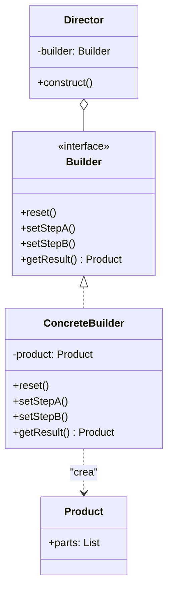

# Builder

Permite contruir objetos complejos paso a paso, No requiere que el producto tenga una interfaz comun y permite producri diferentes tipos y representaciones de un objeto utilizando el mismo objeto de construccion.

### Caso de uso

Normalmente se usa en los casos donde se tiene un producto con muchos campos, algunos necesarios y otros no. Sin builder tendrias un constructor con muchos parametros y llenos de null, Builder permite crear el objeto de forma legible y seteando solo los campos que se requeiran.

### Diagrama UML

