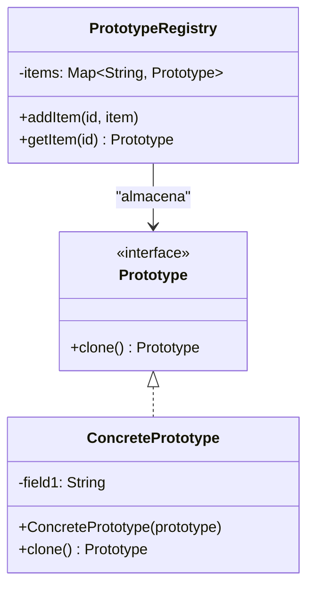

# Prototype

Permite copiar objetos existentes sin que el código dependa de sus clases. En lugar de crear una instancia nueva mediante el operador ```new```, se solicita al objeto original que genere una copia de sí mismo.

### Caso de uso
Cuando se tienen un objeto con cientos de propiedades y varios de estos objetos. Carcar los N objetos desde la BD o algun otro lugar es ineficiente si solo cambiaran ciertas propiedades en los objetos. Es por eso que se usa Prototype, para cargar un unico objeto una sola vez y despues clonarlo y cambiar las propiedades necesarias.

### Diagrama UML

