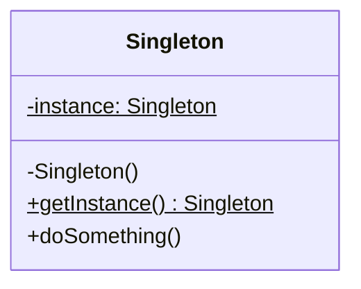

# Singleton

Garantiza que una clase tenga una única instancia en todo el ciclo de vida de la aplicación, proporcionando un punto de acceso global a dicha instancia. Suele utilizarse para gestionar recursos compartidos.

### Caso de uso

Se usa cuando se requiere una unica instancia de una clase en todo el ciclo de vida de la aplicacion, normalmente es usado en Pool de conexiones de base de datos.

### Diagrama UML

